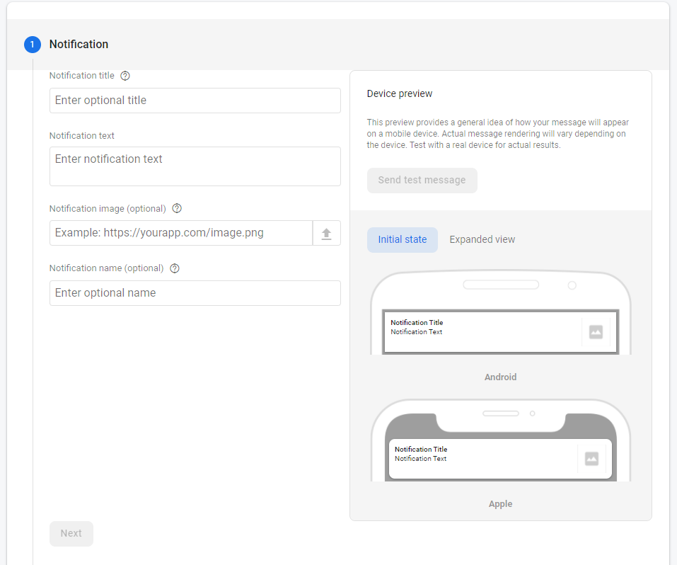
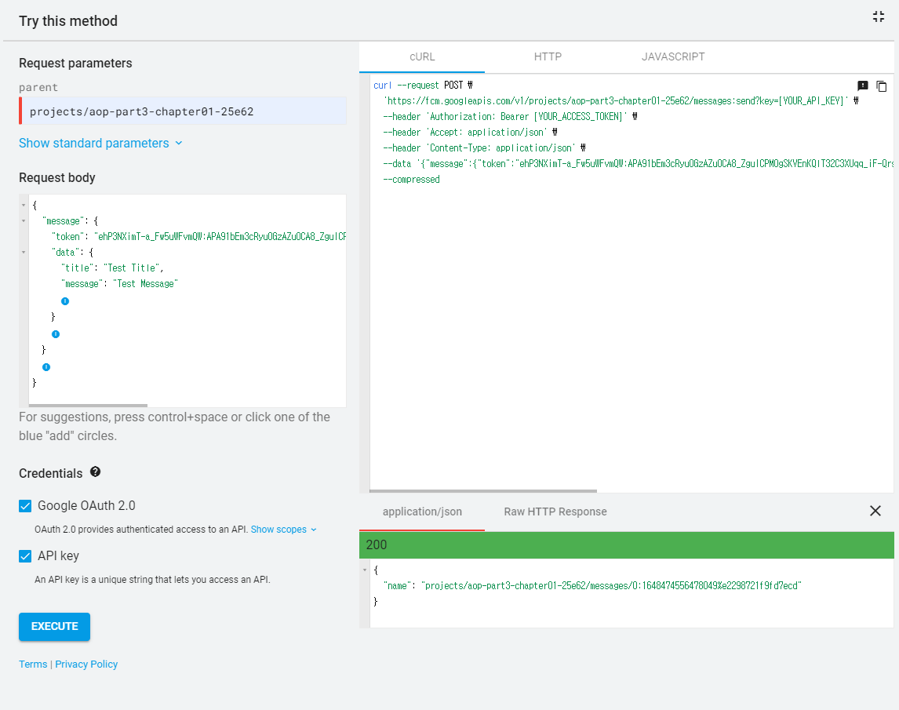
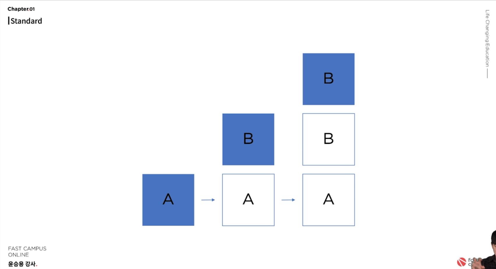
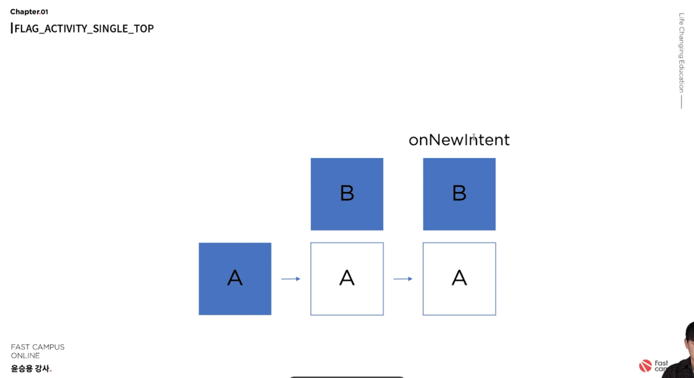

# Chapter01 - Notification 기능 구현하기

##  메시지 전송 테스트

- Firebase Android Gradle SDK 셋업
- Firebase 프로젝트 셋업
- `OnCompleteListener`를 이용해 token 값 받아오기
```kotlin
FirebaseMessaging.getInstance().token.addOnCompleteListener { task ->
    if(task.isSuccessful){
        val token = task.result
        binding.firebaseTokenTextView.text = token
    }
}
```

- [메시지 전송 테스트 페이지](https://console.firebase.google.com/project/aop-part3-chapter01-25e62/notification/compose)에서 테스트하기



## FirebaseMessagingService
- `Manifest`에 서비스 등록
```xml
<service
    android:name=".MyFirebaseMessagingService"
    android:exported="false">
    <intent-filter>
        <action android:name="com.google.firebase.MESSAGING_EVENT" />
    </intent-filter>
</service>
```
- `FirebaseMessagingService` 서비스 등록을 통해 메시지와 토큰을 처리한다.
- `onNewToken` 오버라이드 함수를 통해 토큰이 변경 됐을 때 이벤트를 처리한다. ([토큰이 변경되는 경우](https://firebase.google.com/docs/cloud-messaging/android/first-message?hl=ko&authuser=0#access_the_registration_token))
- `onMessageReceived` 오버라이드 함수를 통해 메시지를 받았을 때 이벤트를 처리한다.
- `onMessageReceived`함수 내에 중단점을 걸고 [메시지 전송 테스트 페이지](https://firebase.google.com/docs/reference/fcm/rest/v1/projects.messages/send)에서 테스트 메시지 전송하기



## [Channel 설정](https://developer.android.com/training/notify-user/channels?hl=ko)
- Android 8.0(API 수준 26) 부터 알람 채널 할당
- Channel ID, Channel Name, Channel Description, [Channel Importance](https://developer.android.com/training/notify-user/channels?hl=ko#importance) 설정 필요
```kotlin
private fun createNotificationChannel() {
    if (Build.VERSION.SDK_INT >= Build.VERSION_CODES.O) {
        val channel = NotificationChannel(
            CHANNEL_ID,
            CHANNEL_NAME,
            NotificationManager.IMPORTANCE_DEFAULT
        )
        channel.description = CHANNEL_DESCRIPTION

        (getSystemService(Context.NOTIFICATION_SERVICE) as NotificationManager)
            .createNotificationChannel(channel)
    }
}
```

## Notification 생성
- Build 패턴으로 생성 
```kotlin
NotificationCompat.Builder(this, CHANNEL_ID)
    .setSmallIcon(R.drawable.ic_baseline_circle_notifications_24)
    .setContentTitle(title)
    .setContentText(message)
    .setPriority(NotificationCompat.PRIORITY_DEFAULT)
    .setContentIntent(pendingIntent)
    .setAutoCancel(true)
    .build()
```
- 필요에 따라 레이아웃 설정 변경
    - Normal, Expandable, Custom 등
    - Custom Layout 사용시 [RemoteView](https://developer.android.com/reference/android/widget/RemoteViews) 사용
    - enum 클래스로 분리하여 사용
- [PendingIntent](https://developer.android.com/reference/android/app/PendingIntent)를 사용하여 Notification 클릭시 이동하는 액티비티 지정 가능


## Intent Flags
- 기존의 Activity를 쌓는 방식은 Activity를 쌓는 스택 방식
- Intent Flag를 통해 제어 가능




- FLAG_ACTIVITY_SINGLE_TOP



- 호출한 Activity의 `override fun onNewIntent(intent: Intent?)` 함수 호출

