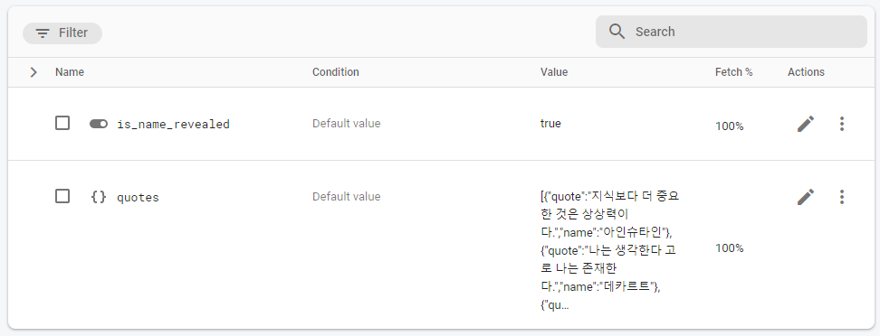

# Chapter01 - Notification 기능 구현하기

##  메시지 전송 테스트

- Firebase Android Gradle SDK 셋업
- Firebase 프로젝트 셋업
- `OnCompleteListener`를 이용해 token 값 받아오기
```kotlin
FirebaseMessaging.getInstance().token.addOnCompleteListener { task ->
    if(task.isSuccessful){
        val token = task.result
        binding.firebaseTokenTextView.text = token
    }
}
```

- [메시지 전송 테스트 페이지](https://console.firebase.google.com/project/aop-part3-chapter01-25e62/notification/compose)에서 테스트하기


## FirebaseMessagingService
- `Manifest`에 서비스 등록
```xml
<service
    android:name=".MyFirebaseMessagingService"
    android:exported="false">
    <intent-filter>
        <action android:name="com.google.firebase.MESSAGING_EVENT" />
    </intent-filter>
</service>
```
- `FirebaseMessagingService` 서비스 등록을 통해 메시지와 토큰을 처리한다.
- `onNewToken` 오버라이드 함수를 통해 토큰이 변경 됐을 때 이벤트를 처리한다. ([토큰이 변경되는 경우](https://firebase.google.com/docs/cloud-messaging/android/first-message?hl=ko&authuser=0#access_the_registration_token))
- `onMessageReceived` 오버라이드 함수를 통해 메시지를 받았을 때 이벤트를 처리한다.
- `onMessageReceived`함수 내에 중단점을 걸고 [메시지 전송 테스트 페이지](https://firebase.google.com/docs/reference/fcm/rest/v1/projects.messages/send)에서 테스트 메시지 전송하기


## [Channel 설정](https://developer.android.com/training/notify-user/channels?hl=ko)
- Android 8.0(API 수준 26) 부터 알람 채널 할당
- Channel ID, Channel Name, Channel Description, [Channel Importance](https://developer.android.com/training/notify-user/channels?hl=ko#importance) 설정 필요
```kotlin
private fun createNotificationChannel() {
    if (Build.VERSION.SDK_INT >= Build.VERSION_CODES.O) {
        val channel = NotificationChannel(
            CHANNEL_ID,
            CHANNEL_NAME,
            NotificationManager.IMPORTANCE_DEFAULT
        )
        channel.description = CHANNEL_DESCRIPTION

        (getSystemService(Context.NOTIFICATION_SERVICE) as NotificationManager)
            .createNotificationChannel(channel)
    }
}
```

## Notification 생성
- Build 패턴으로 생성 
```kotlin
NotificationCompat.Builder(this, CHANNEL_ID)
    .setSmallIcon(R.drawable.ic_baseline_circle_notifications_24)
    .setContentTitle(title)
    .setContentText(message)
    .setPriority(NotificationCompat.PRIORITY_DEFAULT)
    .setContentIntent(pendingIntent)
    .setAutoCancel(true)
    .build()
```
- 필요에 따라 레이아웃 설정 변경
    - Normal, Expandable, Custom 등
    - Custom Layout 사용시 [RemoteView](https://developer.android.com/reference/android/widget/RemoteViews) 사용
    - enum 클래스로 분리하여 사용
- [PendingIntent](https://developer.android.com/reference/android/app/PendingIntent)를 사용하여 Notification 클릭시 이동하는 액티비티 지정 가능


## Intent Flags
- 기존의 Activity를 쌓는 방식은 Activity를 쌓는 스택 방식
- Intent Flag를 통해 제어 가능


- FLAG_ACTIVITY_SINGLE_TOP


- 호출한 Activity의 `override fun onNewIntent(intent: Intent?)` 함수 호출


# Chapter02 - 오늘의 명언

## Firebase Remote Config
- firebase 콘솔에서 remote config를 수정하는 것만으도로 이미 지정된 코드를 통해 앱을 재 출시할 필요 없이 변경할 수 있다.
- use cases
    - 배포된 어플의 일정 유저에게만 새로운 기능 출시하기
    - 지역, 언어별 문구나 이미지 등 원격 수정
    - 제한된 그룹에게 새로운 기능 테스트
- [Throttling](https://firebase.google.com/docs/remote-config/get-started?hl=en&authuser=0&platform=android#throttling)
    - 개발환경에서는 짧은 시간 간격으로 페치를 진행 할 수 있지만, 실제 배포 환경에서는 자주 페치를 수행하면 Throttling이 걸릴 수 있다.
    - `minimumFetchIntervalInSeconds` 속성을통해 최소 페치 인터벌을 12시간으로 제한해야한다.
- `fetch`, `activate`로 구성하여 사용
```kotlin
remoteConfig.fetchAndActivate().addOnCompleteListener {
    if (it.isSuccessful) {
        val quotes = parseQuotesJson(remoteConfig.getString("quotes"))
        val isNameRevealed = remoteConfig.getBoolean("is_name_revealed")
    }
}
```


## ViewPager
- `ViewHolder Pattern`으로 구현
- 아이템 개수 무한으로 늘리기
    - 아이템 개수를 int max 값으로 설정 
    ```kotlin
    override fun getItemCount() = Int.MAX_VALUE
    ```
    - `onBindViewHolder`함수에서 bind하는 아이템을 조정
    ```kotlin
    override fun onBindViewHolder(holder: QuoteViewHolder, position: Int) {
        val actualPosition = position % quotes.size // position이 itemList 범위를 벗어나도 다시 0부터 시작한다.
        holder.bind(quotes[actualPosition], isNameRevealed)
    }
    ```
    - adapter 바인딩 직후 현재 Item을 ItemCount의 중간에 있는 position에 해당하는 Item으로 설정하여 양 옆으로 모두 이동이 가능하도록 설정한다.
    ```kotlin
    binding.viewPager.adapter = adapter
    binding.viewPager.setCurrentItem(adapter.itemCount / 2 - 1 , false)
    ```
- 아이템 자연스럽게 전환하기
    - `setPageTransformer`함수를 통해 페이지 전환시 이벤트를 설정한다
    - Item의 Position이 0에 가까워 질수록 alpha 값을 1로 수렴하게 한다
    ```kotlin
    binding.viewPager.setPageTransformer { page, position ->
        when{
            position.absoluteValue >= 1F -> {
                page.alpha = 0F
            }

            position == 0F -> {
                page.alpha = 1F
            }

            else -> {
                page.alpha = 1F - 2 * position.absoluteValue
            }
        }
    }
    ```

# Chapter03 - 알람 앱

## kotlin format chatacter
- 숫자 자리수를 지정해줄 때 유용하다
    - %d : 정수값 지정
    - %f : 소수값 지정 (.2f 의미는 소수점 기준으로 하위 2자리까지 출력)
    -  %s : 문자열값 지정
```kotlin 
val str = "%02d, %.2f".format(4, 10) // 04, 10.00
```

## [Shared Preferences](https://developer.android.com/training/data-storage/shared-preferences)
- key-value 쌍을 저장할 때 사용한다.
- name, key를 지정해놓고 사용해야 하는데 `companion object`에 const로 할당해서 사용하는게 좋다.
- 여러 데이터를 저장할 때에는 Json 형식으로 사용하면 편하다.
- Pregerences를 가져 올때 `MODE_PRIVATE` 모드로 가져오는데 다른앱에서 사용하지 못하게 한다. 퍼블릭으로 사용하는 방법은 deprecated
- 에디터 저장시에 `commit()`, `apply()` 2가지 방법이 있다.
    - `commit() : boolean` : 쓰레드를 블록시키며 실행 결과값을 boolean으로 리턴한다
    - `apply() : Unit` : 쓰레드를 블록시키지 않는다.

## Background 작업
- Immediate tasks (즉시 실행해야하는 작업)
    - Thread
    - Handler
    - Kotlin coroutines
- Deferred tasks (지연된 작업)
    - WorkManager
- Exact tasks (정시에 실행해야 하는 작업)
    - AlarmManager

## [AlarmManager](https://developer.android.com/training/scheduling/alarms)
- 원하는 시간에 이벤트를 발생시킬 수 있음
    - RTC_WAKEUP : 절대시간 (absolute time)
    - ELAPSED_REALTIME_WAKEUP : 휴대폰이 부팅 된 이후 지난 시간
- 알람을 설정 할 때 `setRepeating()` 대신 `setInexactRepeating()`을 사용하면 자원을 줄일 수 있다. 하지만 시간 정확도는 떨어진다.
- doze모드에서 사용이 필요하면 `setAndAllowWhileIdle(), setExactAndAllowWhileIdle()`을 사용하면 된다.